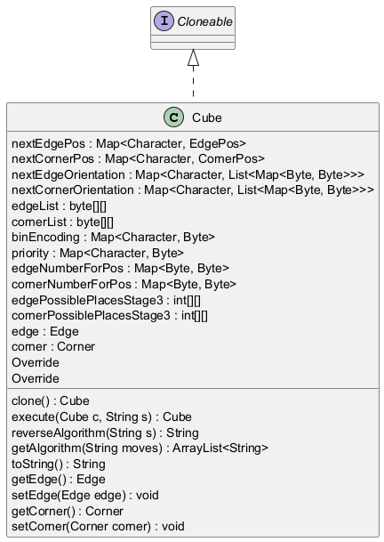

# Generated Documentation with UML
## Cube Class Documentation

This document provides detailed documentation for the `Cube` class, outlining each function's purpose, functionality, dependencies, and potential improvements.

**Class Overview:**

The `Cube` class likely represents a Rubik's Cube object, encapsulating the state of the cube's edges and corners. It provides methods to manipulate the cube's state by applying algorithms and moves, as well as methods to retrieve and modify its internal representation. The core data structures likely involve `Edge` and `Corner` classes, which in turn manage the positions and orientations of the cube's pieces.

**Dependencies:**

The class heavily relies on helper classes and data structures for representing the cube state and defining move transformations. The dependencies include:

*   `Edge`: Represents the edges of the cube.
*   `Corner`: Represents the corners of the cube.
*   `EdgePos`: Represents the permutation of edge positions.
*   `EdgeOrientation`: Represents the orientation of the edges.
*   `CornerPos`: Represents the permutation of corner positions.
*   `CornerOrientation`: Represents the orientation of the corners.
*   `nextEdgePos`, `nextEdgeOrientation`, `nextCornerPos`, `nextCornerOrientation`: These are likely data structures (Maps/Arrays) that define how edge and corner positions and orientations change with each move. They are likely static fields within the `Cube` class or in related helper classes.
**Assumptions:**

*   Each function call takes place in the `Cube` class.
*   That the `Edge`, `Corner`, `EdgePos`, `EdgeOrientation`, `CornerPos`, `CornerOrientation` classes have a method called `clone()` and setters and getters for their respective properties.

**Function Documentation (In Dependency Order):**

Since a definitive dependency order isn't explicitly provided, I will address the methods in a logical order, starting with the simplest getters/setters and moving towards the more complex algorithm-related functions.

1.  **`Cube.getEdge()`**

    *   **Purpose:** Retrieves the `Edge` object representing the current state of the cube's edges.
    *   **Body:**

        ```java
        {
            return edge;
        }
        ```

    *   **Functionality:** This method simply returns the value of the `edge` instance variable.  It's a standard getter method.
    *   **Business Logic:** Provides access to the edge configuration of the cube, which can be used for analysis or manipulation.
    *   **Cyclomatic Complexity:** 1 (very simple).
    *   **Pain Points:** None. It's a basic getter.

2.  **`Cube.setEdge(Edge edge)`**

    *   **Purpose:** Sets the `Edge` object for the cube.
    *   **Body:**

        ```java
        {
            this.edge = edge;
        }
        ```

    *   **Functionality:**  This method sets the value of the `edge` instance variable to the provided `edge` object.  It's a standard setter method.
    *   **Business Logic:**  Allows modifying the edge configuration of the cube, usually as a result of applying a move.
    *   **Cyclomatic Complexity:** 1 (very simple).
    *   **Pain Points:** None. It's a basic setter.

3.  **`Cube.getCorner()`**

    *   **Purpose:** Retrieves the `Corner` object representing the current state of the cube's corners.
    *   **Body:**

        ```java
        {
            return corner;
        }
        ```

    *   **Functionality:** This method simply returns the value of the `corner` instance variable. It's a standard getter method.
    *   **Business Logic:** Provides access to the corner configuration of the cube, which can be used for analysis or manipulation.
    *   **Cyclomatic Complexity:** 1 (very simple).
    *   **Pain Points:** None. It's a basic getter.

4.  **`Cube.setCorner(Corner corner)`**

    *   **Purpose:** Sets the `Corner` object for the cube.
    *   **Body:**

        ```java
        {
            this.corner = corner;
        }
        ```

    *   **Functionality:** This method sets the value of the `corner` instance variable to the provided `corner` object. It's a standard setter method.
    *   **Business Logic:** Allows modifying the corner configuration of the cube, usually as a result of applying a move.
    *   **Cyclomatic Complexity:** 1 (very simple).
    *   **Pain Points:** None. It's a basic setter.

5.  **`Cube.clone()`**

    *   **Purpose:** Creates a deep copy of the `Cube` object.
    *   **Body:**

        ```java
        {
            return new Cube(this.getEdge().clone(), this.getCorner().clone());
        }
        ```

    *   **Functionality:** This method creates a new `Cube` object. Crucially, it calls the `clone()` methods on both the `Edge` and `Corner` objects. This ensures that the new `Cube` object has its own independent copies of the edge and corner data, preventing unintended modifications to the original cube.
    *   **Business Logic:**  Essential for performing operations on a cube without modifying the original, such as exploring different solution paths or executing moves on a temporary copy.
    *   **Cyclomatic Complexity:** 1 (Relatively simple).  However, the complexity is heavily reliant on the `Edge.clone()` and `Corner.clone()` implementations.
    *   **Pain Points:** The correctness of this method depends entirely on the correct implementation of deep copy in the `Edge` and `Corner` classes. Any shallow copies there would lead to problems.

6.  **`Cube.reverseAlgorithm(String s)`**

    *   **Purpose:** Reverses an algorithm string and triples each character.
    *   **Body:**

        ```java
        {
            StringBuilder result = new StringBuilder();
            for (int i = 0; i < s.length(); i++) result.append(String.valueOf(s.charAt(i)).repeat(3));
            return new StringBuilder(result.toString()).reverse().toString();
        }
        ```

    *   **Functionality:** This method takes a string `s` as input, iterates through each character in the string, and appends that character three times to a `StringBuilder`.  Then the `StringBuilder` is reversed and converted back to a String.
    *   **Business Logic:** Reversing an algorithm is a common operation in solving Rubik's Cubes, as it allows undoing a sequence of moves. The tripling of characters might represent a convention for inverting moves (e.g., R becomes R' which internally is represented as RRR).
    *   **Cyclomatic Complexity:** 1 (single loop).
    *   **Pain Points:**  The tripling of characters might be unusual and require more context to fully understand its purpose. The use of `String.valueOf(s.charAt(i)).repeat(3)` is relatively recent Java syntax.

7.  **`Cube.getAlgorithm(String moves)`**

    *   **Purpose:** Parses a sequence of cube moves and simplifies it into a standard notation.
    *   **Body:**

        ```java
        {
            class Temp {

                final char ch;

                final byte b;

                public Temp(char ch, byte b) {
                    this.ch = ch;
                    this.b = b;
                }
            }
            Stack<Temp> s = new Stack<>();
            ArrayList<String> v = new ArrayList<>(Arrays.asList("", "", "2", "'"));
            ArrayList<String> result = new ArrayList<>();
            for (int i = 0; i < moves.length(); i++) {
                if (s.isEmpty() || s.peek().ch != moves.charAt(i))
                    s.push(new Temp(moves.charAt(i), (byte) 1));
                else {
                    Temp x = s.pop();
                    if (x.b != (byte) 3)
                        s.push(new Temp(x.ch, (byte) (x.b + 1)));
                }
            }
            while (!s.isEmpty()) {
                Temp x = s.pop();
                if (x.b != 0)
                    result.add(0, x.ch + v.get(x.b));
            }
            return result;
        }
        ```

    *   **Functionality:** This method parses a string of cube moves and simplifies it. It uses a Stack to keep track of consecutive moves of the same face. The `Temp` class is used to store the move character and the number of repetitions. The `v` ArrayList stores the suffixes for the moves ("" for 1 repetition, "2" for 2 repetitions, and "'" for 3 repetitions, representing a counter-clockwise move).
    *   **Business Logic:** This function aims to convert raw move sequences into a more human-readable format, combining consecutive moves of the same face (e.g., "RRR" becomes "R'").
    *   **Cyclomatic Complexity:** Moderate.  It has a loop and conditional statements, and the stack operations add complexity.
    *   **Pain Points:**
        *   The use of a local `Temp` class adds some verbosity. It could be simplified using a `Pair` or similar data structure.
        *   The magic numbers (1, 2, 3) and the hardcoded suffix list (`v`) could be made more readable by using constants.
        *   The logic for adding to the `result` list at index 0 could be less efficient than adding to the end and then reversing the list.

    **Example:**
    Input: "RRRUUULLL"
    Output: ["R'", "U'", "L'"]

8.  **`Cube.execute(Cube c, String s)`**

    *   **Purpose:** Executes a given algorithm on a cube and returns the resulting cube.
    *   **Body:**

        ```java
        {
            Cube temp = c.clone();
            String[] moves = s.split(" ");
            if (moves.length > 1) {
                StringBuilder sBuilder = new StringBuilder();
                for (String string : moves) {
                    if (string.length() == 1)
                        sBuilder.append(string.charAt(0));
                    else if (string.charAt(1) == '2')
                        sBuilder.append(String.valueOf(string.charAt(0)).repeat(2));
                    else
                        sBuilder.append(String.valueOf(string.charAt(0)).repeat(3));
                }
                s = sBuilder.toString();
            }
            for (int i = 0; i < s.length(); i++) {
                char ch = s.charAt(i);
                EdgePos edgePos = temp.getEdge().getEdgePos().clone();
                EdgeOrientation edgeOrientation = temp.getEdge().getEdgeOrientation().clone();
                for (int j = 0; j < 12; j++) {
                    edgeOrientation.setVal(j, nextEdgeOrientation.get(ch).get(edgePos.getVal()[j]).get(edgeOrientation.getVal()[j]));
                    edgePos.setVal(j, nextEdgePos.get(ch).getVal()[edgePos.getVal()[j]]);
                }
                temp.setEdge(new Edge(edgePos, edgeOrientation));
                CornerPos cornerPos = temp.getCorner().getCornerPos().clone();
                CornerOrientation cornerOrientation = temp.getCorner().getCornerOrientation().clone();
                for (int j = 0; j < 8; j++) {
                    cornerOrientation.setVal(j, nextCornerOrientation.get(ch).get(cornerPos.getVal()[j]).get(cornerOrientation.getVal()[j]));
                    cornerPos.setVal(j, nextCornerPos.get(ch).getVal()[cornerPos.getVal()[j]];
                }
                temp.setCorner(new Corner(cornerPos, cornerOrientation));
            }
            return temp;
        }
        ```

    *   **Functionality:** This method takes a `Cube` object `c` and an algorithm string `s` as input. It first clones the input cube to avoid modifying the original. It then parses the algorithm string, handling moves with "2" and "'" notations (e.g., "R2", "R'"). The core of the method iterates through each move in the algorithm.  For each move, it retrieves the `EdgePos`, `EdgeOrientation`, `CornerPos`, and `CornerOrientation` from the temporary cube. It then updates these values based on pre-defined mappings (`nextEdgePos`, `nextEdgeOrientation`, `nextCornerPos`, `nextCornerOrientation`) that determine how each move affects the positions and orientations of the edges and corners. Finally, it sets the new `Edge` and `Corner` objects in the temporary cube and returns it.
    *   **Business Logic:** This is the central function for applying moves to the cube and simulating the effect of an algorithm. The `nextEdgePos`, `nextEdgeOrientation`, `nextCornerPos`, and `nextCornerOrientation` data structures are the key to defining the cube's mechanics.  These data structures map each move to the corresponding permutation and orientation changes.
    *   **Cyclomatic Complexity:** High.  The nested loops and conditional logic, combined with the manipulation of complex data structures, contribute to a high cyclomatic complexity.
    *   **Pain Points:**
        *   The code is quite dense and difficult to read. Breaking it down into smaller, more focused functions would improve readability and maintainability.
        *   The reliance on magic numbers (12 for edges, 8 for corners) makes the code less self-documenting. Using named constants would be better.
        *   The deeply nested `get()` calls on `nextEdgeOrientation` and `nextCornerOrientation` can be difficult to follow.
        *   The error handling is non-existent.  If an invalid move character is encountered, the code will likely throw an exception or produce incorrect results.

    **Example:**
    Input: `c` (a solved cube), `s` = "R U R' U'"
    Output: `temp` (the cube after executing the R U R' U' algorithm)

9.  **`Cube.toString()`**

    *   **Purpose:** Returns a string representation of the `Cube` object.
    *   **Body:**

        ```java
        {
            return "Cube{\n" + "edge=" + edge.toString() + ",\ncorner=" + corner.toString() + "\n}";
        }
        ```

    *   **Functionality:** This method returns a string representation of the `Cube` object, including the string representations of its `edge` and `corner` attributes. It relies on the `toString()` methods of the `Edge` and `Corner` classes.
    *   **Business Logic:** Provides a way to easily inspect the state of the cube, which is useful for debugging and logging.
    *   **Cyclomatic Complexity:** 1 (simple string concatenation).
    *   **Pain Points:** The readability of the output depends on the `toString()` implementations of the `Edge` and `Corner` classes. A more structured output (e.g., using JSON) might be preferable in some cases.
    *   **Improvement:**  Consider using a JSON library or a more structured format for better readability and machine-parseability.

## UML Diagram


