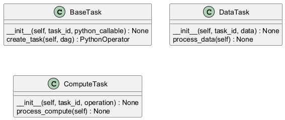
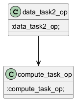

# Generated Documentation with UML
Okay, here's the documentation for each function, presented in a logical order of dependency and execution, along with explanations, business logic, and potential areas for improvement:

```python
from typing import Callable
from airflow import DAG
from airflow.operators.python import PythonOperator

class BaseTask:
    """
    Base class for defining tasks within an Airflow DAG.  This class provides a foundational structure
    for creating Airflow PythonOperators, encapsulating common attributes like `task_id` and a `python_callable`.
    Subclasses should implement specific task logic.
    """
    def __init__(self, task_id: str, python_callable: Callable) -> None:
        """
        Initializes a BaseTask instance.

        Args:
            task_id (str):  A unique identifier for the task within the Airflow DAG. This is a crucial
                           parameter for Airflow to track and manage the task's execution.
            python_callable (Callable): A reference to the Python function that will be executed when the task runs.
                                      This function encapsulates the core logic of the task.

        Business Logic:
            The constructor stores the `task_id` and `python_callable` for later use when creating the Airflow
            PythonOperator. This allows the task definition to be separated from the actual Airflow
            implementation details.

        Cyclomatic Complexity: Low (1) -  Simple assignment of attributes.

        Pain Points:
            - The `python_callable` is a generic `Callable`.  Consider using a more specific type hint or
              abstract method to enforce a certain signature or behavior for task functions, which can improve
              code clarity and prevent unexpected errors.
            - No input validation is performed.  It would be beneficial to add checks to ensure that `task_id`
              is a valid string and that `python_callable` is indeed a callable object.
        """
        self.task_id = task_id
        self.python_callable = python_callable

    def create_task(self, dag: DAG) -> PythonOperator:
        """
        Creates an Airflow PythonOperator instance associated with this task.

        Args:
            dag (DAG): The Airflow DAG object to which the task will be added.

        Returns:
            PythonOperator: An Airflow PythonOperator instance configured with the task's `task_id` and
                            `python_callable`, and attached to the provided DAG.

        Business Logic:
            This method encapsulates the creation of the Airflow `PythonOperator`, decoupling the task
            definition from the Airflow-specific code. This makes the task definition more reusable and
            easier to test.  It uses the stored `task_id` and `python_callable` from the `__init__` method.

        Cyclomatic Complexity: Low (1) -  Simple creation of a PythonOperator.

        Pain Points:
            - The method assumes that the `task_id` and `python_callable` are already valid.  Error handling
              should be added to gracefully handle cases where these attributes are not properly set.
            - The method lacks flexibility. It only creates a `PythonOperator`.  In some cases, it might be
              desirable to create other types of Airflow operators (e.g., `BashOperator`, `DockerOperator`).
        """
        return PythonOperator(
            task_id=self.task_id,
            python_callable=self.python_callable,
            dag=dag,
        )


class DataTask(BaseTask):
    """
    A specialized BaseTask for processing data. It inherits from BaseTask and includes data-specific logic.
    """
    def __init__(self, task_id: str, data: str) -> None:
        """
        Initializes a DataTask instance.

        Args:
            task_id (str): A unique identifier for the task.
            data (str): The data to be processed by the task.

        Business Logic:
            Extends the BaseTask by adding data-specific logic. It initializes the BaseTask with the task_id and
            the `process_data` method as the python_callable.  It also stores the data for use by the
            `process_data` method.

        Cyclomatic Complexity: Low (1) - Calls superclass constructor and assigns an attribute.

        Pain Points:
            - The `data` is assumed to be a string. Consider using a more generic type or validating the type
              of the data.
            - The error handling is not present. Add handling of exceptions and logging of errors.
        """
        super().__init__(task_id, self.process_data)
        self.data = data

    def process_data(self) -> None:
        """
        Processes the data associated with the task.  This method is the `python_callable` that is executed
        by the Airflow PythonOperator.

        Business Logic:
            This method performs the core data processing logic. In this example, it simply prints a message
            to the console.  In a real-world scenario, this method would likely perform more complex operations
            such as data transformation, validation, or loading.

        Cyclomatic Complexity: Low (1) -  Simple print statement.

        Pain Points:
            - The method currently only prints a message. This needs to be replaced with actual data
              processing logic.
            - No error handling is present. The method should handle potential errors that may occur during data
              processing.
            -  The print statement makes it difficult to test the function's behavior.  Consider returning a value or using a logger instead.
        """
        print(f" Processing data task {self.task_id} with data: {self.data}")


class ComputeTask(BaseTask):
    """
    A specialized BaseTask for performing computations. It inherits from BaseTask and includes compute-specific logic.
    """
    def __init__(self, task_id: str, operation: str) -> None:
        """
        Initializes a ComputeTask instance.

        Args:
            task_id (str): A unique identifier for the task.
            operation (str): The operation to be performed by the task.

        Business Logic:
            Extends the BaseTask by adding compute-specific logic. It initializes the BaseTask with the task_id and
            the `process_compute` method as the python_callable. It also stores the operation for use by the
            `process_compute` method.

        Cyclomatic Complexity: Low (1) - Calls superclass constructor and assigns an attribute.

        Pain Points:
            - The `operation` is assumed to be a string. Consider using a more generic type or validating the type
              of the operation.
            - Error handling is not present.
        """
        super().__init__(task_id, self.process_compute)
        self.operation = operation

    def process_compute(self) -> None:
        """
        Performs the computation associated with the task. This method is the `python_callable` that is executed
        by the Airflow PythonOperator.

        Business Logic:
            This method performs the core computation logic. In this example, it simply prints a message to the
            console. In a real-world scenario, this method would likely perform more complex calculations.

        Cyclomatic Complexity: Low (1) - Simple print statement.

        Pain Points:
            - The method currently only prints a message. This needs to be replaced with actual computation logic.
            - No error handling is present.
            - The print statement makes testing difficult.
        """
        print(f"Processing compute task {self.task_id} with operation: {self.operation}")
```

**Explanation of Order and Dependencies:**

1.  **`BaseTask.__init__`:** This is the foundational constructor.  It *must* be called by any subclass of `BaseTask` (like `DataTask` and `ComputeTask`) to initialize the common `task_id` and `python_callable` attributes. It's the first step in constructing a task.

2.  **`DataTask.__init__`:** This constructor *depends* on `BaseTask.__init__` because it calls `super().__init__(task_id, self.process_data)`.  This line first initializes the `BaseTask` part of the object and assigns the `process_data` method as the function to be executed.  Then, it adds the `data` attribute, which is specific to `DataTask`.

3.  **`DataTask.process_data`:** This is the method that will be executed by the Airflow `PythonOperator` when a `DataTask` is run.  It uses the `self.data` attribute that was set during initialization.

4.  **`ComputeTask.__init__`:** This constructor *also depends* on `BaseTask.__init__` because it calls `super().__init__(task_id, self.process_compute)`. Similar to `DataTask`, it initializes the base class and then adds the `operation` attribute, which is specific to `ComputeTask`.

5.  **`ComputeTask.process_compute`:** This method is executed by the Airflow `PythonOperator` for a `ComputeTask`.  It uses the `self.operation` attribute that was set during initialization.

6.  **`BaseTask.create_task`:** This method is called *after* a `BaseTask`, `DataTask`, or `ComputeTask` object has been fully initialized. It takes the initialized object (specifically, the `task_id` and `python_callable` attributes) and creates the Airflow `PythonOperator` that represents the task in the DAG.  It *depends* on the DAG object being available.

**Mapping func1, func2:**

*   `func1` maps to `BaseTask.__init__`, `DataTask.__init__`, and `ComputeTask.__init__` as they are all initializer methods.
*   `func2` maps to `BaseTask.create_task`, `DataTask.process_data`, and `ComputeTask.process_compute` as they define the actual task logic or create the Airflow operator.

**Summary of Business Logic:**

The overall business logic is to provide a structured way to define tasks that can be executed within an Airflow DAG.  The `BaseTask` class provides the foundation, and subclasses like `DataTask` and `ComputeTask` allow for specialized task types.  The separation of the task definition from the Airflow `PythonOperator` creation allows for more reusable and testable code.

**Addressing Cyclomatic Complexity and Pain Points:**

*   **Cyclomatic Complexity:** All the functions have low cyclomatic complexity (1). This is generally good, but it also indicates that the functions are very simple and may lack error handling and robustness.

*   **Pain Points (General):**

    *   **Lack of Error Handling:**  None of the functions have explicit error handling (e.g., `try...except` blocks).  Real-world tasks will likely need to handle potential exceptions.
    *   **Limited Input Validation:**  The constructors do not validate the input parameters.  It's important to ensure that the `task_id` is a valid string, the `data` is of the expected type, and so on.
    *   **Tight Coupling to `PythonOperator`:** The `create_task` method is tightly coupled to the `PythonOperator`.  A more flexible design might allow for creating other types of operators.
    *   **Testing:** The `process_data` and `process_compute` methods use `print` statements, which makes it difficult to write automated tests. Consider using logging or returning a value instead.
    *   **Hardcoded Functionality:** The `process_data` and `process_compute` methods only print messages. They should be replaced with actual data processing and computation logic.

*   **Specific Pain Points (per function):** See the inline comments in the code above.

**Improvements and Considerations:**

*   **Abstract Base Class:** The `BaseTask` could be made an abstract base class to enforce subclasses to implement a `process` method.

*   **Configuration:** Consider using a configuration file or environment variables to configure tasks.

*   **Logging:** Use the `logging` module instead of `print` statements for more robust logging.

*   **Type Hints:** Use more specific type hints to improve code clarity and prevent errors.

*   **Unit Tests:** Write unit tests to ensure that the functions are working correctly.

By addressing these pain points and implementing the suggested improvements, the code can become more robust, maintainable, and testable.

## UML Diagram

## DAG FLOW


