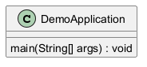

# Generated Documentation with UML
## Function Documentation

This documentation describes the functions provided, their functionalities, dependencies, and other relevant details.

### 1. `DemoApplication.main(String[] args)`

**Purpose:**

This is the entry point of the Spring Boot application. It's responsible for bootstrapping and launching the application context.

**Functionality:**

The `main` function calls `SpringApplication.run()` to start the Spring Boot application. This method performs several crucial tasks, including:

1.  **Setting up the Application Context:** It creates and configures the Spring application context, which manages the beans (objects) and their dependencies.
2.  **Scanning for Components:** It scans the classpath for Spring components (e.g., `@Component`, `@Service`, `@Controller`, `@Repository`) and registers them as beans in the application context. This is how Spring discovers and manages your application's logic.
3.  **Starting the Embedded Server:** It starts the embedded web server (e.g., Tomcat, Jetty, Undertow) if your application is a web application.
4.  **Executing Application Runners and CommandLineRunners:** It executes any beans that implement the `ApplicationRunner` or `CommandLineRunner` interfaces. These runners can be used to perform initialization tasks when the application starts up.

**Parameters:**

*   `String[] args`:  An array of command-line arguments passed to the application. These arguments can be used to configure the application's behavior, such as setting properties or specifying profiles.

**Example Snippet:**

```java
package com.example.demo;

import org.springframework.boot.SpringApplication;
import org.springframework.boot.autoconfigure.SpringBootApplication;

@SpringBootApplication
public class DemoApplication {

    public static void main(String[] args) {
        SpringApplication.run(DemoApplication.class, args);
    }

}
```

In this example, `@SpringBootApplication` is a convenience annotation that combines `@Configuration`, `@EnableAutoConfiguration`, and `@ComponentScan`. It tells Spring Boot to configure the application, enable auto-configuration features, and scan for components in the current package and its subpackages.

**Business Logic:**

The business logic lies within the components that Spring discovers and manages.  The `main` method simply starts the container that makes all of the individual components available. For example, the business logic might consist of REST endpoints in a controller that expose an API or scheduled tasks defined in a service.

**Cyclomatic Complexity:**

The cyclomatic complexity of the `main` method itself is very low (typically 1). The complexity resides in the Spring Boot framework and the beans it manages.

**Pain Points:**

*   **Complex Configuration:** Spring Boot's auto-configuration can sometimes be difficult to understand or customize.  If the default behavior doesn't meet your needs, you may need to dive into the configuration properties and override the auto-configuration.
*   **Dependency Management:** Managing dependencies in a Spring Boot project can be challenging, especially with a large number of dependencies.  Tools like Maven or Gradle can help, but it's still important to understand how dependencies are resolved and managed.
*   **Application startup time:** Can be slow if there are many components to load and dependencies to resolve.


## UML Diagram


