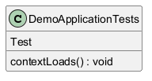

# Generated Documentation with UML
## Function Documentation

This documentation details the provided function, `DemoApplicationTests.contextLoads()`, and its associated dependencies.

**1. `DemoApplicationTests.contextLoads()`**

*   **Description:** This function is commonly found in Spring Boot applications within the test suite. It serves as a basic integration test to verify that the application context loads successfully. In essence, it checks if Spring can initialize all the beans and dependencies declared in your application without errors.

*   **Body:**
    ```java
    {
    }
    ```
    The provided body is empty, indicating that the function performs no explicit operations beyond what's implicitly handled by the testing framework (e.g., Spring Test). The successful loading of the application context is the assertion being made, not any specific lines of code within the function.

*   **Functionality:** The function, when executed as part of a JUnit test, will attempt to load the application context defined by your Spring Boot application. If the context loads without throwing any exceptions, the test is considered to have passed. If any beans fail to initialize or dependencies are missing, the test will fail, indicating a configuration problem in your Spring application.

*   **Business Logic:** The business logic is indirectly related to the overall application's health. A successful `contextLoads` test assures developers that the core components of their application can be initialized and wired together correctly. This simple test acts as a foundational validation step, preventing larger problems at later stages of development, such as runtime errors due to uninitialized beans or missing dependencies. It's usually run during build process.

*   **Example:**

    Imagine you have a Spring Boot application with controllers, services, and repositories. The `contextLoads` test ensures that Spring can create instances of all these components and inject the necessary dependencies (e.g., injecting a `UserRepository` into a `UserService`). A failure would suggest misconfiguration like circular dependencies or missing component annotations (`@Component`, `@Service`, `@Repository`, `@Controller`).

*   **Dependencies:** This function's execution depends on the Spring TestContext Framework and the configuration of your Spring Boot application. It does not have direct dependencies on the custom functions.

*   **Cyclomatic Complexity:** The cyclomatic complexity is 1. Because, there are no conditional statements (if/else), loops, or other branching constructs. It represents the simplest possible control flow.

*   **Pain Points:**

    *   **Lack of Specificity:** This test, while important, is very broad. A failure indicates *something* is wrong, but it doesn't pinpoint the exact cause. Developers will still need to investigate the exception stack trace to identify the root problem.
    *   **Maintenance:** As the application grows, the `contextLoads` test can become slower to execute because it initializes the entire application context. While still valuable, it might be necessary to supplement it with more granular integration tests focusing on specific slices of the application.
    *   **Implicit Assertion:** The assertion (that the context loads successfully) is implicit. There are no explicit `assert` statements in the function body. This can make it less clear, especially for new developers, what the purpose of the test is. A comment explaining the purpose is always a good addition.

## UML Diagram


