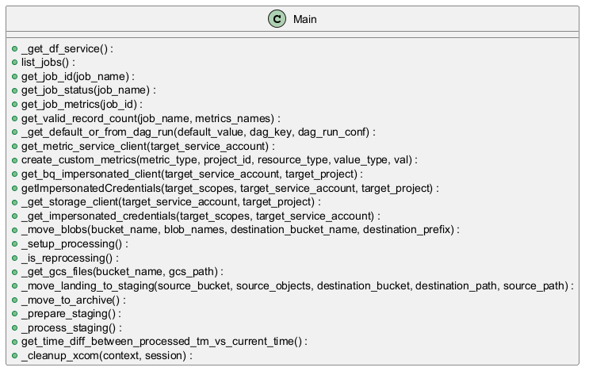
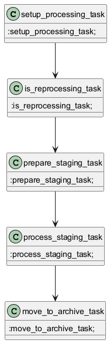

# Generated Documentation with UML
```python
from airflow.providers.google.cloud.hooks.gcs import GCSHook
from airflow.providers.google.cloud.transfers.gcs_to_gcs import GCSToGCSOperator
from airflow.utils.decorators import apply_defaults
import logging
import time
import uuid
import os
from airflow.operators.bash import BashOperator
from airflow.models import BaseOperator
from googleapiclient import discovery
from googleapiclient.discovery import build
from airflow.exceptions import AirflowFailException
from airflow.providers.google.cloud.operators.dataflow import DataflowTemplatedJobStartOperator
from googleapiclient.errors import HttpError
from airflow.models import XCom
from google.cloud import monitoring_v3
from google.cloud import bigquery
import datetime
from datetime import timezone
from airflow.providers.google.cloud.operators.gcs import GCSListObjectsOperator

dag = None # Initialize dag to None, it will be assigned a value by the DAG code
SUFFIX = os.getenv("SUFFIX", "")
DAGID = os.getenv("DAG_ID")
RELEASE_RAW = os.getenv("RELEASE_RAW", "raw")

# Constants for DAG parameters
DAG_PARAM_GCS_LANDING_BUCKET_NAME = "gcs_landing_bucket_name"
DAG_PARAM_GCS_LANDING_BUCKET_PATH = "gcs_landing_bucket_path"
DAG_PARAM_GCS_ARCHIVE_BUCKET_NAME = "gcs_archive_bucket_name"
DAG_PARAM_GCS_ARCHIVE_BUCKET_PATH = "gcs_archive_bucket_path"
DAG_PARAM_GCS_STAGING_BUCKET_NAME = "gcs_staging_bucket_name"
DAG_PARAM_GCS_STAGING_BUCKET_PATH = "gcs_staging_bucket_path"
DAG_PARAM_RUN_ID = "run_id"
DAG_PARAM_NUM_PAST_HOURS = "num_past_hours"

# Constants for task parameters
TASK_PARAM_LANDING_BUCKET_NAME = "landing_bucket_name"
TASK_PARAM_LANDING_BUCKET_PATH = "landing_bucket_path"
TASK_PARAM_ARCHIVE_BUCKET_NAME = "archive_bucket_name"
TASK_PARAM_ARCHIVE_BUCKET_PATH = "archive_bucket_path"
TASK_PARAM_RUN_BUCKET_NAME = "run_bucket_name"
TASK_PARAM_RUN_BUCKET_PATH = "run_bucket_path"
TASK_PARAM_RUN_PATH_FULL = "run_path_full"
TASK_PARAM_REPROCESSING = "reprocessing"
TASK_PARAM_JOB_NAME = "job_name"
TASK_PARAM_NUM_PAST_HOURS = "num_past_hours"

# Task IDs
TASK_SETUP_PROCESSING = "setup_processing"
TASK_PREPARE_STAGING = "prepare_staging"
TASK_SKIP_PREPARE_STAGING = "skip_prepare_staging"
TASK_TRIGGER_DF_JOB = "trigger_dataflow_job"

TEST_RUN = os.getenv("TEST_RUN", "false")
DATAFLOW_SERVICE_ACCOUNT = os.getenv("DATAFLOW_SERVICE_ACCOUNT", "")
COMPOSER_SERVICE_ACCOUNT = os.getenv("COMPOSER_SERVICE_ACCOUNT", "")
CUSTOM_METRIC_DOMAIN = os.getenv("CUSTOM_METRIC_DOMAIN", "custom.googleapis.com")
PIPELINE_PROJECT_ID = os.getenv("PIPELINE_PROJECT_ID", "")
DATAFLOW_REGION = os.getenv("DATAFLOW_REGION", "")
DATAFLOW_TEMPLATE_LOCATION = os.getenv("DATAFLOW_TEMPLATE_LOCATION", "")
DATAFLOW_TEMP_LOCATION = os.getenv("DATAFLOW_TEMP_LOCATION", "")
GCS_LANDING_BUCKET_NAME = os.getenv("GCS_LANDING_BUCKET_NAME", "")
GCS_LANDING_BUCKET_PATH = os.getenv("GCS_LANDING_BUCKET_PATH", "")
GCS_ARCHIVE_BUCKET_NAME = os.getenv("GCS_ARCHIVE_BUCKET_NAME", "")
GCS_ARCHIVE_BUCKET_PATH = os.getenv("GCS_ARCHIVE_BUCKET_PATH", "")
GCS_STAGING_BUCKET_NAME = os.getenv("GCS_STAGING_BUCKET_NAME", "")
GCS_STAGING_BUCKET_PATH = os.getenv("GCS_STAGING_BUCKET_PATH", "")
DF_JOB_NAME = os.getenv("DF_JOB_NAME", "")
MAX_RETRIES = int(os.getenv("MAX_RETRIES", "3"))
DEFAULT_NUM_HOURS = os.getenv("DEFAULT_NUM_HOURS", "24")
DELIMITER = os.getenv("DELIMITER", "/")
billing_label = os.getenv("label", "pnr-data-ingestion")
VAR_AS_DF_NUM_WORKERS = os.getenv("VAR_AS_DF_NUM_WORKERS", "")
VAR_AS_DF_MAX_WORKERS = os.getenv("VAR_AS_DF_MAX_WORKERS", "")
VAR_AS_DF_MACHINE_TYPE = os.getenv("VAR_AS_DF_MACHINE_TYPE", "")
VAR_AS_MAX_FILES = os.getenv("VAR_AS_MAX_FILES", "")
service_account_name = os.getenv("sa_name", "")
FRESHNESS_CHECK_DATASET_NAME = os.getenv("dataset_name", "")
FRESHNESS_CHECK_TABLE_NAME = os.getenv("table_name", "")

#default user labels
USER_LABELS = {"application": "PNR"}

def get_dag_vars():
    from airflow.models import Variable
    dag_vars = {}
    for var in Variable.all():
        dag_vars[var] = Variable.get(var)
    return dag_vars

def get_dag_var_as_int(var,dag_vars):
    if var in dag_vars and dag_vars[var].isdigit():
        return int(dag_vars[var])
    else:
        return 1

def get_dag_var_as_string(var,dag_vars):
    if var in dag_vars:
        return dag_vars[var]
    else:
        return "n1-standard-1"

def group_partitions_per_hour(files, prefix):
    partitioned_files = {}
    for file in files:
        file = file.replace(prefix, "")
        parts = file.split("/")
        if len(parts) > 1:
            partition = parts[0] + "/" + parts[1]
        else:
            partition = "default"
        if partition not in partitioned_files:
            partitioned_files[partition] = []
        partitioned_files[partition].append(file)
    return partitioned_files

def select_files(files, prefix, num_past_hours):
    selected_files = []
    now_utc = datetime.datetime.now(timezone.utc)
    for file in files:
        try:
            file = file.replace(prefix, "")
            parts = file.split("/")
            year = int(parts[0])
            month = int(parts[1])
            day = int(parts[2])
            hour = int(parts[3])
            file_date = datetime.datetime(year, month, day, hour, tzinfo=timezone.utc)
            time_diff = now_utc - file_date
            if time_diff.total_seconds() <= num_past_hours * 3600:
                selected_files.append(file)
        except Exception as ex:
            logging.info(f"Skipping file [{file}], exception [{ex}]")
    return selected_files
```

### Function Documentation

#### 1. `get_metric_service_client(target_service_account)`

```python
def get_metric_service_client(target_service_account: str):
    target_scopes = ['https://www.googleapis.com/auth/cloud-platform']
    return monitoring_v3.MetricServiceClient()
```

**Purpose:** This function instantiates and returns a `MetricServiceClient` from the `google.cloud.monitoring_v3` library. This client is used to interact with the Google Cloud Monitoring API, allowing you to create and manage custom metrics.

**How it works:**
   - It defines a list of OAuth 2.0 scopes (`target_scopes`) required for accessing the Cloud Monitoring API. In this case, it's the `https://www.googleapis.com/auth/cloud-platform` scope, which grants broad access to Google Cloud Platform services.
   - It then creates and returns an instance of `monitoring_v3.MetricServiceClient()`.  It doesn't use the `target_service_account` or the defined scopes in the current implementation, which is a potential issue.

**Business Logic:**  The function's purpose is to provide a pre-configured client to interact with Cloud Monitoring. Custom metrics are used to track application-specific data and gain insights into the performance and behavior of your workflows, outside of standard metrics provided by GCP.

**Cyclomatic Complexity:** Low (1).  Simple function with no branching.

**Pain Points:**
   - The `target_service_account` argument is not actually used in the function, which could lead to confusion. Ideally it should configure the `MetricServiceClient` to use the provided service account.
   - The function doesn't explicitly handle authentication. It relies on the environment having default credentials configured.
   - The OAuth scope is hardcoded.

#### 2. `_get_default_or_from_dag_run(default_value, dag_key, dag_run_conf)`

```python
def _get_default_or_from_dag_run(default_value: str, dag_key, dag_run_conf):
    if dag_run_conf is not None and dag_key in dag_run_conf:
        return dag_run_conf[dag_key]
    return default_value
```

**Purpose:** This function retrieves a value for a given configuration parameter.  It first checks if the parameter is provided in the DAG run configuration (`dag_run_conf`). If not, it returns a default value.

**How it works:**
   - It checks if `dag_run_conf` is not `None` and if the specified `dag_key` exists within the `dag_run_conf` dictionary.
   - If both conditions are true, it returns the value associated with `dag_key` from `dag_run_conf`. This allows users to override default settings when triggering the DAG.
   - Otherwise, it returns the `default_value`.

**Business Logic:** This function is crucial for parameterizing the DAG. It allows the DAG to be configured via the Airflow UI or API when triggering a DAG run, enabling flexibility without modifying the DAG code directly.  It allows you to override default settings when triggering the DAG.

**Cyclomatic Complexity:** Low (1). Single `if` statement.

**Pain Points:**
   - The type hint for `default_value` is `str`, but the function doesn't enforce this. It might lead to errors if non-string default values are passed.
   - The function's name is verbose.

**Example:**
```python
default_bucket = "my-default-bucket"
dag_config = {"gcs_bucket": "override-bucket"}
bucket_name = _get_default_or_from_dag_run(default_bucket, "gcs_bucket", dag_config)
print(bucket_name)  # Output: override-bucket

bucket_name = _get_default_or_from_dag_run(default_bucket, "some_other_key", dag_config)
print(bucket_name) # Output: my-default-bucket
```

#### 3. `create_custom_metrics(metric_type, project_id, resource_type, value_type, val)`

```python
def create_custom_metrics(metric_type: str, project_id: str, resource_type: str, value_type: str, val):
    try:
        client = get_metric_service_client(COMPOSER_SERVICE_ACCOUNT)
        project_name = f"projects/{project_id}"
        series = monitoring_v3.TimeSeries()
        series.metric.type = CUSTOM_METRIC_DOMAIN + "/" + metric_type
        series.metric.labels['application_name'] = DAGID
        series.metric.labels['workflow_name'] = DAGID
        series.resource.type = resource_type
        series.resource.labels["project_id"] = project_id
        series.resource.labels["workflow_name"] = DAGID
        series.resource.labels["location"] = "us-central1"
        now = time.time()
        seconds = int(now)
        nanos = int((now - seconds) * 10 ** 9)
        interval = monitoring_v3.TimeInterval(
            {"end_time": {"seconds": seconds, "nanos": nanos}}
        )
        point = monitoring_v3.Point({"interval": interval, "value": {value_type: val}})
        series.points = [point]
        client.create_time_series(name=project_name, time_series=[series])
    except Exception as ex:
        logging.error("Error [{}] occurred while inserting/creating custom metric".format(str(ex)))
```

**Purpose:** This function creates and pushes custom metrics to Google Cloud Monitoring.

**How it works:**
   - It retrieves a `MetricServiceClient` using `get_metric_service_client` with the `COMPOSER_SERVICE_ACCOUNT`.
   - It constructs a `TimeSeries` object, which represents the data point to be recorded.
     - `series.metric.type`:  Sets the metric type by combining `CUSTOM_METRIC_DOMAIN` with the provided `metric_type`.
     - `series.metric.labels`: Adds labels to the metric for filtering and aggregation (application_name, workflow_name).
     - `series.resource.type`: Specifies the resource being monitored (e.g., "cloud_composer_workflow").
     - `series.resource.labels`:  Adds labels to the resource (project_id, workflow_name, location).
     - `series.points`: Creates a `Point` object with the current timestamp and the metric value.
   - It calls `client.create_time_series` to push the metric to Cloud Monitoring.
   - It includes a try-except block to catch potential exceptions during metric creation and logging the error.

**Business Logic:** This function allows you to track key performance indicators (KPIs) specific to your Airflow DAG, such as the number of processed files, data freshness, or custom application metrics.  These metrics can be visualized in Cloud Monitoring dashboards and used to set up alerts.

**Cyclomatic Complexity:** Low (1). Try-except block adds minimal complexity.

**Pain Points:**
   -  Error handling could be more specific. Currently, it catches all exceptions.
   -  The location is hardcoded as "us-central1". It should be configurable.
   - The dependency on global variables like `DAGID` and `COMPOSER_PROJECT_ID` makes the function less reusable and harder to test.
   - The `CUSTOM_METRIC_DOMAIN` is used as a prefix, the domain should be validated for a proper custom one.

#### 4. `_get_df_service()`

```python
def _get_df_service():
    df_service = build("dataflow", "v1b3", cache_discovery=False)
    logging.info("df service [{}]".format(df_service))
    return df_service
```

**Purpose:** This function initializes and returns a Google Dataflow service client using the `googleapiclient.discovery.build` function.

**How it works:**
   - It uses `build("dataflow", "v1b3", cache_discovery=False)` to create a Dataflow service object. `v1b3` represents the API version. `cache_discovery=False` prevents caching of the API discovery document, ensuring it always retrieves the latest version.
   - It logs the created service object for debugging purposes.

**Business Logic:**  The function provides a reusable way to access the Dataflow API, which is used to manage and monitor Dataflow jobs. It encapsulates the API client creation process.

**Cyclomatic Complexity:** Low (1).  Simple function with no branching.

**Pain Points:**
   -  The function doesn't handle authentication explicitly. It relies on the environment having default credentials configured.
   -  The API version (`v1b3`) is hardcoded. It might be beneficial to make it configurable.
   -  No error handling is present.

#### 5. `_move_blobs(bucket_name, blob_names, destination_bucket_name, destination_prefix, **context)`

```python
def _move_blobs(bucket_name: str, blob_names: list, destination_bucket_name: str,
                destination_prefix: str, **context):
    logging.info(f"Moving blobs from [{bucket_name}] to [{destination_bucket_name}/{destination_prefix}]")
    num_blobs = len(blob_names)
    time_millis = round(time.time() * 1000)
    tmp_file = f"/tmp/pnr{SUFFIX}_file_copy_{time_millis}.txt"
    with open(tmp_file, "a") as f:
        for i, blob_name in enumerate(blob_names):
            logging.info(
                f"[{i + 1}/{num_blobs}] Adding blob [{bucket_name}/{blob_name}]...")
            f.writelines(f"gs://{bucket_name}/{blob_name}\n")

    impersonation_opts = "" if TEST_RUN == "true" else f"-i {DATAFLOW_SERVICE_ACCOUNT}"
    gsutil_path = "/google-cloud-sdk/bin/" if TEST_RUN == "true" else ""
    gsutil_state_opts = f"-o 'GSUtil:state_dir=/tmp/pnr{SUFFIX}_gsutil_state_{time_millis}'"
    bash_cmd = f"cat {tmp_file} | {gsutil_path}gsutil {gsutil_state_opts} {impersonation_opts} -m mv -I 'gs://{destination_bucket_name}/{destination_prefix}/'"
    logging.info(f"Executing Bash command [{bash_cmd}]")
    file_copy_using_gsutil = BashOperator(
        task_id="file_copy_using_gsutil" + str(uuid.uuid4()),
        bash_command=bash_cmd
    )
    file_copy_using_gsutil.execute(context)
    os.remove(tmp_file)

    logging.info(f"Moved blobs from file [{tmp_file}] to [{destination_bucket_name}/{destination_prefix}]")
```

**Purpose:**  This function moves multiple blobs (files) from one Google Cloud Storage (GCS) bucket to another using the `gsutil mv` command.

**How it works:**
   - It logs the source and destination buckets and path.
   - It creates a temporary file (`tmp_file`) to store a list of the blobs to be moved, one blob per line.
   - It iterates through the `blob_names` list and writes each blob's full GCS path (e.g., `gs://bucket-name/path/to/blob`) to the temporary file.
   - It constructs a `gsutil` command to move the blobs.  This command uses:
     - `cat {tmp_file}`:  Reads the list of blobs from the temporary file.
     - `gsutil -m mv -I 'gs://{destination_bucket_name}/{destination_prefix}/'`: Moves the blobs to the destination bucket and prefix. The `-m` option enables parallel moving (faster). `-I` option reads the list of files to move from stdin.
     - Implements impersonation options and state options to enhance process run.
   - The `BashOperator` executes the command, which copies the blobs from the source to the destination.
   - Finally, the temporary file is removed.

**Business Logic:** This function provides an efficient way to move multiple files between GCS buckets. It's often used for data migration, archiving, and data processing pipelines. The use of `gsutil -m` makes it faster for large numbers of files.

**Cyclomatic Complexity:** Low-Medium (2). A `for` loop and an `if` condition for `TEST_RUN`.

**Pain Points:**
   - Using a temporary file to store the list of blobs can be inefficient for extremely large numbers of files. Consider using `subprocess.Popen` and piping the list of blobs directly to `gsutil`'s stdin without creating a file.
   -  Error handling is limited to what `BashOperator` provides.  The function itself doesn't explicitly handle potential errors during file operations or `gsutil` execution.
   -  The `gsutil` path is hardcoded.
   - The code uses a BashOperator within the python code, which could lead to context switching issues and make testing difficult.

#### 6. `_setup_processing(**context)`

```python
def _setup_processing(**context):
    logging.info(f"Starting DAG [{DAGID}-{RELEASE_RAW}]")
    logging.info("Preparing partition")
    logging.info(f"Context [{context}]")
    execution_dt_utc = context["logical_date"]
    logging.info(f"Execution datetime [{execution_dt_utc}] UTC")

    task_instance = context["task_instance"]
    dag_run = context["dag_run"]
    dag_run_conf = dag_run.conf if dag_run else None

    gcs_landing_bucket_name = _get_default_or_from_dag_run(GCS_LANDING_BUCKET_NAME, DAG_PARAM_GCS_LANDING_BUCKET_NAME,
                                                           dag_run_conf)
    gcs_landing_bucket_path = _get_default_or_from_dag_run(GCS_LANDING_BUCKET_PATH, DAG_PARAM_GCS_LANDING_BUCKET_PATH,
                                                           dag_run_conf)
    gcs_archive_bucket_name = _get_default_or_from_dag_run(GCS_ARCHIVE_BUCKET_NAME, DAG_PARAM_GCS_ARCHIVE_BUCKET_NAME,
                                                           dag_run_conf)
    gcs_archive_bucket_path = _get_default_or_from_dag_run(GCS_ARCHIVE_BUCKET_PATH, DAG_PARAM_GCS_ARCHIVE_BUCKET_PATH,
                                                           dag_run_conf)
    gcs_staging_bucket_name = _get_default_or_from_dag_run(GCS_STAGING_BUCKET_NAME, DAG_PARAM_GCS_STAGING_BUCKET_NAME,
                                                           dag_run_conf)
    gcs_staging_bucket_path = _get_default_or_from_dag_run(GCS_STAGING_BUCKET_PATH, DAG_PARAM_GCS_STAGING_BUCKET_PATH,
                                                           dag_run_conf)
    num_past_hours = _get_default_or_from_dag_run(DEFAULT_NUM_HOURS, DAG_PARAM_NUM_PAST_HOURS, dag_run_conf)


    logging.info(f"Landing bucket name [{gcs_landing_bucket_name}]")
    logging.info(f"Landing bucket path [{gcs_landing_bucket_path}]")
    logging.info(f"Staging bucket name [{gcs_staging_bucket_name}]")
    logging.info(f"Staging bucket path [{gcs_staging_bucket_path}]")
    logging.info(f"Archive bucket name [{gcs_archive_bucket_name}]")
    logging.info(f"Archive bucket path [{gcs_archive_bucket_path}]")
    logging.info(f"Num past hours [{num_past_hours}]")

    if dag_run_conf is not None and DAG_PARAM_RUN_ID in dag_run_conf:
        run_id = dag_run_conf[DAG_PARAM_RUN_ID]
        reprocessing_flag = True
        logging.info(f"Using RUN ID from user [{run_id}]")
    else:
        run_id = f"{execution_dt_utc.year:04}{execution_dt_utc.month:02}{execution_dt_utc.day:02}{execution_dt_utc.hour:02}{execution_dt_utc.minute:02}"
        reprocessing_flag = False
        logging.info(f"Creating new RUN ID [{run_id}]")

    gcs_run_path = f"{gcs_staging_bucket_path}/{run_id}"
    gcs_run_full_path = f"{gcs_staging_bucket_name}/{gcs_run_path}"
    logging.info(f"Full RUN path on GCS [{gcs_run_full_path}]")

    job_name = f"{DF_JOB_NAME}-{run_id}"
    logging.info(f"Job name [{job_name}]")

    task_instance.xcom_push(key=TASK_PARAM_LANDING_BUCKET_NAME, value=gcs_landing_bucket_name)
    task_instance.xcom_push(key=TASK_PARAM_LANDING_BUCKET_PATH, value=gcs_landing_bucket_path)
    task_instance.xcom_push(key=TASK_PARAM_ARCHIVE_BUCKET_NAME, value=gcs_archive_bucket_name)
    task_instance.xcom_push(key=TASK_PARAM_ARCHIVE_BUCKET_PATH, value=gcs_archive_bucket_path)
    task_instance.xcom_push(key=TASK_PARAM_RUN_BUCKET_NAME, value=gcs_staging_bucket_name)
    task_instance.xcom_push(key=TASK_PARAM_RUN_BUCKET_PATH, value=gcs_run_path)
    task_instance.xcom_push(key=TASK_PARAM_RUN_PATH_FULL, value=gcs_run_full_path)
    task_instance.xcom_push(key=TASK_PARAM_REPROCESSING, value=reprocessing_flag)
    task_instance.xcom_push(key=TASK_PARAM_JOB_NAME, value=job_name)
    task_instance.xcom_push(key=TASK_PARAM_NUM_PAST_HOURS, value=num_past_hours)
```

**Purpose:** This function prepares the DAG run by retrieving configuration parameters, generating a unique run ID, and pushing these values to XCom for use by downstream tasks.

**How it works:**
   - It retrieves the execution datetime from the `context`.
   - It fetches various GCS bucket names and paths using `_get_default_or_from_dag_run`, which allows overriding default values via the DAG run configuration.
   - It determines the `run_id`. If a `run_id` is provided in the DAG run configuration, it's used, and a `reprocessing_flag` is set to `True`. Otherwise, a new `run_id` is generated based on the execution datetime, and `reprocessing_flag` is set to `False`.
   - It constructs the full GCS path for the run (`gcs_run_full_path`) and the Dataflow job name (`job_name`).
   - It pushes various configuration parameters and the generated `run_id` to XCom using `task_instance.xcom_push`.  These values are then accessible to downstream tasks.

**Business Logic:**  This function centralizes the initialization logic for the DAG. It ensures that all downstream tasks have access to the necessary configuration parameters and the unique run ID. The logic for handling reprocessing (using a user-provided run ID) is also encapsulated here.

**Cyclomatic Complexity:** Medium (2). One `if` condition to check for a user-provided `run_id`.

**Pain Points:**
   -  The function relies heavily on global variables for default values.
   -  There is a lot of XCom pushing, this should be organized.
   - The function is quite long and could be broken down into smaller, more focused functions for better readability and maintainability.

#### 7. `_cleanup_xcom(context, session=None)`

```python
def _cleanup_xcom(context, session=None):
    dag_id = context["dag"].dag_id
    session.query(XCom).filter(XCom.dag_id == dag_id).delete()
```

**Purpose:** This function cleans up XCom entries associated with the current DAG. XCom is a mechanism in Airflow for tasks to exchange data. Cleaning up XCom can prevent the XCom database table from growing too large.

**How it works:**

- It retrieves the `dag_id` from the `context`.
- It queries the Airflow metadata database (using the `session` object) for all `XCom` entries associated with the `dag_id`.
- It deletes all the matching XCom entries.

**Business Logic:** XCom cleanup is a maintenance task that helps ensure the Airflow environment remains healthy and performant. By removing stale XCom entries, it reduces the load on the metadata database and prevents potential performance issues.

**Cyclomatic Complexity:** Low (1). Simple function with no branching.

**Pain Points:**

- Relies on the `session` object being available and correctly configured to connect to the Airflow metadata database.
- No error handling if the database connection fails or if there are issues deleting the XCom entries.
- The function might be too aggressive if XCom values are needed for auditing purposes or by other DAGs.

#### 8. `get_job_metrics(job_id)`

```python
def get_job_metrics(job_id):
    df_service = _get_df_service()
    response = (
        df_service.projects()
        .locations()
        .jobs()
        .getMetrics(projectId=PIPELINE_PROJECT_ID, location=DATAFLOW_REGION, jobId=job_id)
        .execute()
    )
    metrics = response
    return metrics
```

**Purpose:** Retrieves metrics for a specific Dataflow job.

**How it works:**

- Gets a Dataflow service client using `_get_df_service()`.
- Calls the `getMetrics` method on the Dataflow service to retrieve metrics for the given `job_id`, `PIPELINE_PROJECT_ID` and `DATAFLOW_REGION`.
- Returns the `response` containing the metrics.

**Business Logic:** This function provides a way to programmatically access Dataflow job metrics, which can be used for monitoring, alerting, and performance analysis.

**Cyclomatic Complexity:** Low (1).

**Pain Points:**

- Relies on global variables `PIPELINE_PROJECT_ID` and `DATAFLOW_REGION`.
- No error handling if the Dataflow API call fails.
- Assumes the `job_id` is valid.

#### 9. `list_jobs()`

```python
def list_jobs():
    logging.info(f"Listing Dataflow jobs")
    df_service = _get_df_service()
    response = (
        df_service.projects()
        .locations()
        .jobs()
        .list(projectId=PIPELINE_PROJECT_ID, location=DATAFLOW_REGION)
        .execute()
    )
    jobs = response["jobs"]
    return jobs
```

**Purpose:** Lists all Dataflow jobs in a specific project and location.

**How it works:**

- Gets a Dataflow service client using `_get_df_service()`.
- Calls the `list` method on the Dataflow service to retrieve a list of jobs in the `PIPELINE_PROJECT_ID` and `DATAFLOW_REGION`.
- Extracts the "jobs" list from the `response` and returns it.

**Business Logic:** This function is useful for monitoring the status of Dataflow jobs and identifying jobs that need attention.

**Cyclomatic Complexity:** Low (1).

**Pain Points:**

- Relies on global variables `PIPELINE_PROJECT_ID` and `DATAFLOW_REGION`.
- No error handling if the Dataflow API call fails.
- Assumes the API response always contains a "jobs" key.

#### 10. `getImpersonatedCredentials(target_scopes, target_service_account, target_project)`

```python
def getImpersonatedCredentials(target_scopes: list, target_service_account: str, target_project: str):
    from google.auth import _default
    source_credentials, project_id = _default.default(scopes=target_scopes)

    from google.auth import impersonated_credentials
    target_credentials = impersonated_credentials.Credentials(
        source_credentials=source_credentials,
        target_principal=f'{target_service_account}@{target_project}.iam.gserviceaccount.com',
        target_scopes=target_scopes,
        lifetime=600)
    return target_credentials
```

**Purpose:** Obtains impersonated credentials for a target service account.

**How it works:**

- Uses `google.auth._default.default` to get the default credentials and project ID.
- Constructs the target principal (service account email) using the `target_service_account` and `target_project`.
- Uses `google.auth.impersonated_credentials.Credentials` to create impersonated credentials, which allow the application to act as the target service account.
- Sets the `target_scopes` and `lifetime` for the impersonated credentials.

**Business Logic:** Impersonation is a security mechanism that allows one service account (the source) to assume the identity of another service account (the target). This is useful for granting limited access to resources based on the target service account's permissions.

**Cyclomatic Complexity:** Low (1).

**Pain Points:**

- Hardcodes the lifetime of the impersonated credentials to 600 seconds (10 minutes). This might not be appropriate for all use cases.
- The function assumes that the target service account exists and is correctly configured.
- It depends on the `google-auth` library and might require specific versions to work correctly.

#### 11. `_get_gcs_files(bucket_name, gcs_path, **context)`

```python
def _get_gcs_files(bucket_name: str, gcs_path: str, **context):
    logging.info(
        f"Listing files in [{bucket_name}/{gcs_path}]...")
    gcs_list_objects = GCSListObjectsOperator(
        task_id='list_gcs_files' + str(uuid.uuid4()),
        bucket=bucket_name,
        prefix=gcs_path,
        match_glob="**/*" + DELIMITER,
        impersonation_chain=None if TEST_RUN == "true" else DATAFLOW_SERVICE_ACCOUNT,
        dag=dag
    )
    files = gcs_list_objects.execute(context)
    logging.info(
        f"Found [{len(files)}] files in [{bucket_name}/{gcs_path}]")
    return files
```

**Purpose:** Lists files in a Google Cloud Storage (GCS) bucket and path using the `GCSListObjectsOperator`.

**How it works:**

- It creates a `GCSListObjectsOperator` task.
- Sets the `bucket`, `
## UML Diagram

## DAG FLOW


